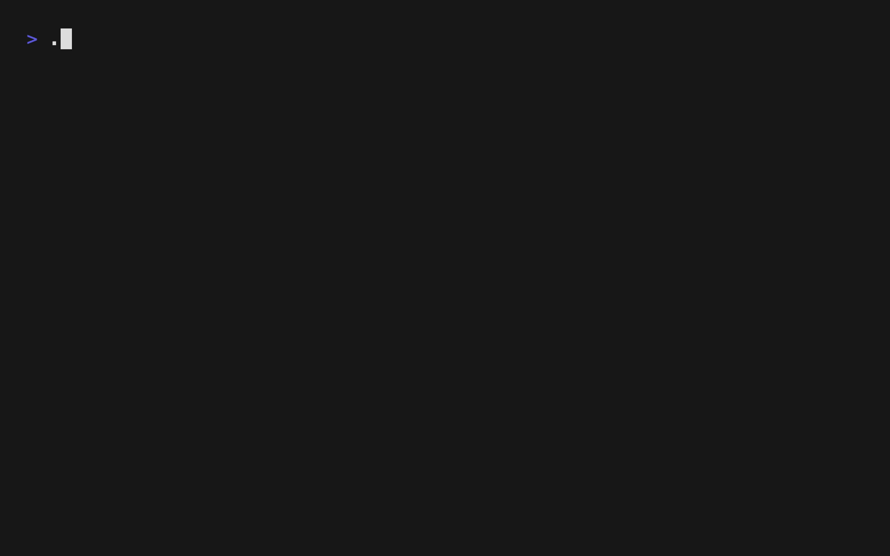

### Hi there 👁️👄👁️

\
Below are some of the technologies and tools I am passionate about and/or use on a daily basis.
<!--
Images downloaded from https://simpleicons.org 
Ordered alphabetically
-->

<!--
**josh-at-sky/josh-at-sky** is a ✨ _special_ ✨ repository because its `README.md` (this file) appears on your GitHub profile.

Here are some ideas to get you started:

- 🔭 I’m currently working on ...
- 🌱 I’m currently learning ...
- 👯 I’m looking to collaborate on ...
- 🤔 I’m looking for help with ...
- 💬 Ask me about ...
- 📫 How to reach me: ...
- 😄 Pronouns: ...
- ⚡ Fun fact: ...
-->